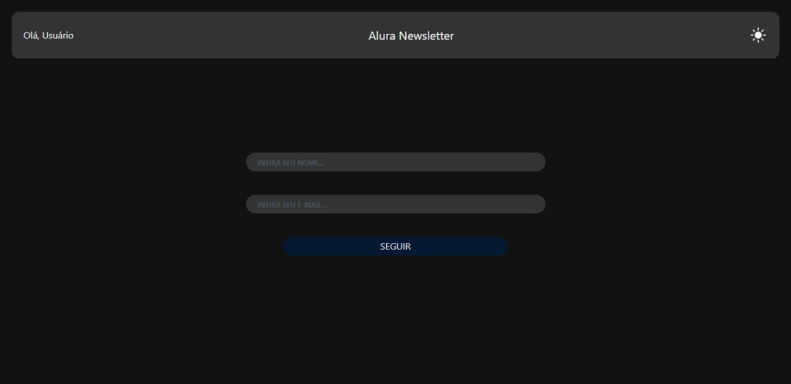
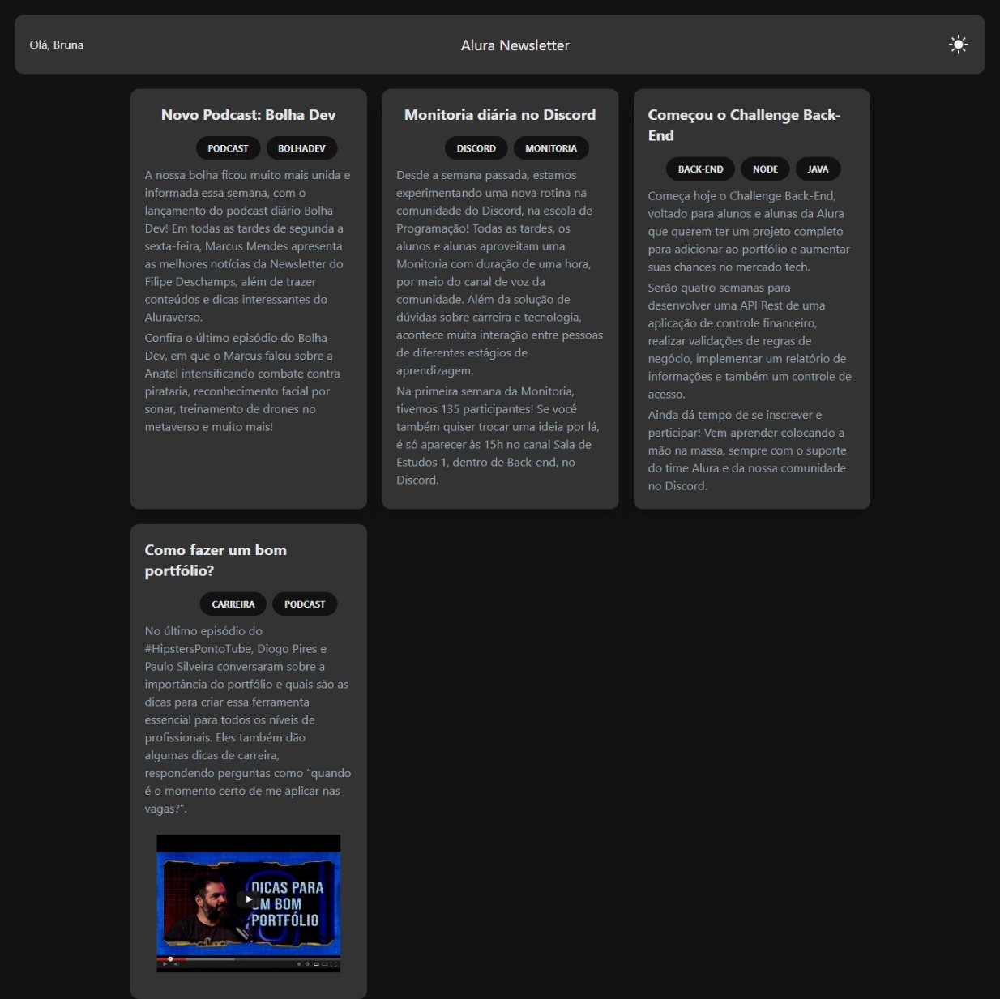

# Alura NewsLetter 📖

O Alura NewsLetter é uma aplicação desenvolvida no curso <a href="https://cursos.alura.com.br/course/react-tailwindcss-estilizando-componentes" target="_blank">React com TailwindCSS: estilizando componentes.</a>.

## 🎯 Objetivo
Foi pensado para: 
- Entender como funciona a estilização com TailwindCSS
- Criar componentes React estilizados e extensíveis
- Desenvolver um padrão de design flexível e performático
- Dominar as animações e transições
- Desenvolver aplicações mobile first e responsivas por padrão

## ✔️ Técnicas e tecnologias utilizadas

Se liga nessa lista de tudo que usaremos nessa formação:

- `React`
- `TailwindCSS`

E muito mais!

## 🛠️ Abrir e rodar o projeto

Para abrir e rodar o projeto, execute `npm i` para instalar as dependências e `npm run dev` para iniciar o projeto.
